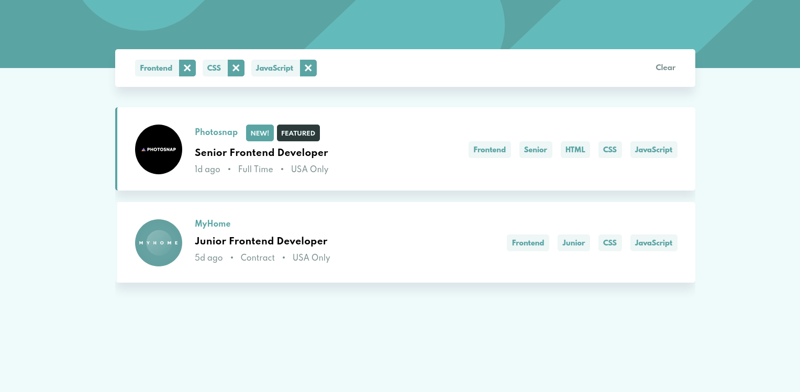

# Frontend Mentor - Job listings with filtering solution

This is a solution to the [Job listings with filtering challenge on Frontend Mentor](https://www.frontendmentor.io/challenges/job-listings-with-filtering-ivstIPCt). Frontend Mentor challenges help you improve your coding skills by building realistic projects.

### The challenge

Users should be able to:

- View the optimal layout for the site depending on their device's screen size
- See hover states for all interactive elements on the page
- Filter job listings based on the categories

### Screenshot

### Links

- Solution URL: (https://your-solution-url.com)
- Live Site URL: (https://rad-concha-f8a7c1.netlify.app/)

### Built with

- Vuejs
- TypeScript
- Tailwindcss

### Author

- Frontend Mentor - [@otr-web-study](https://www.frontendmentor.io/profile/otr-web-study)
